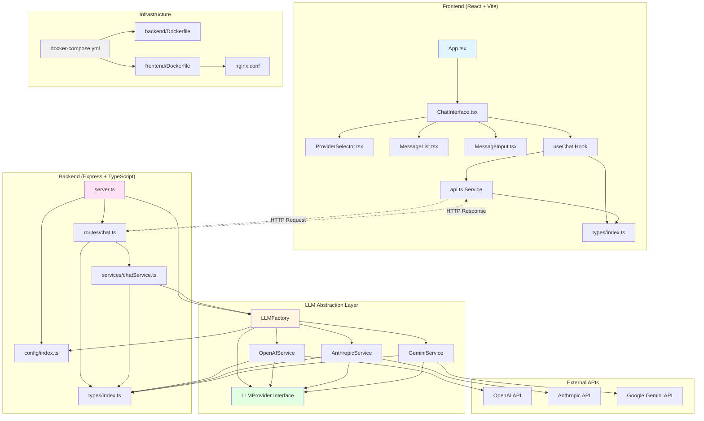
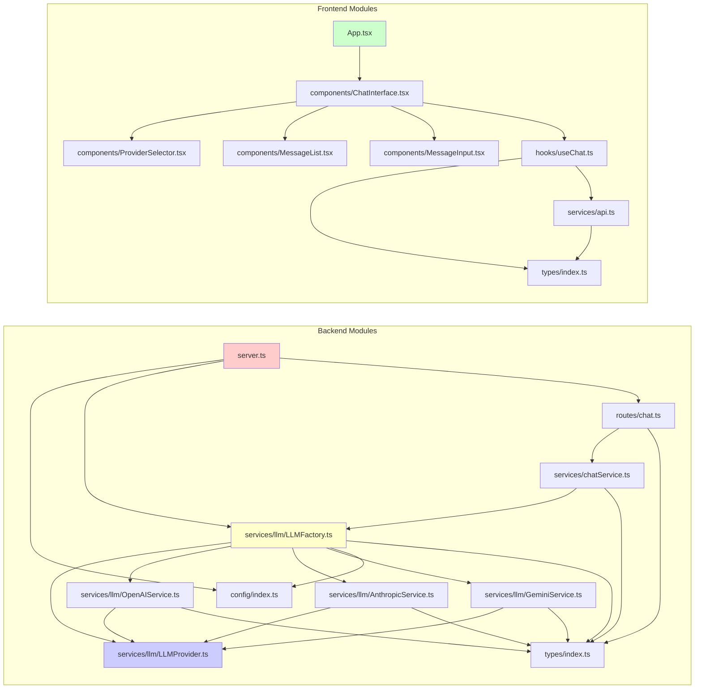
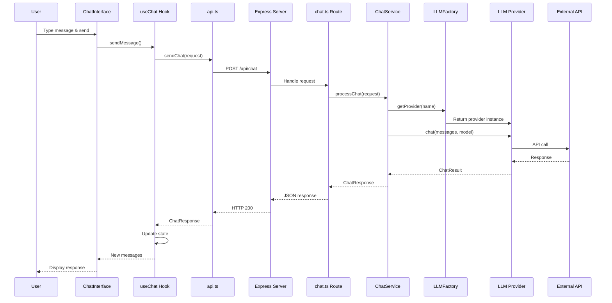
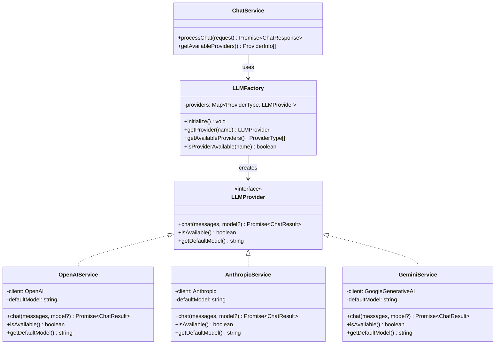
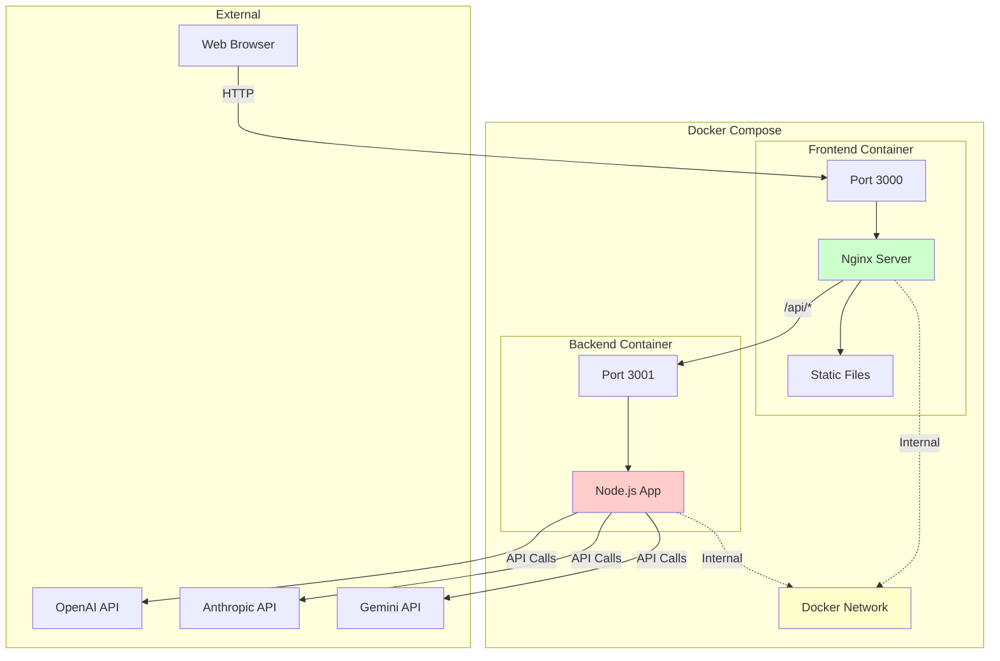
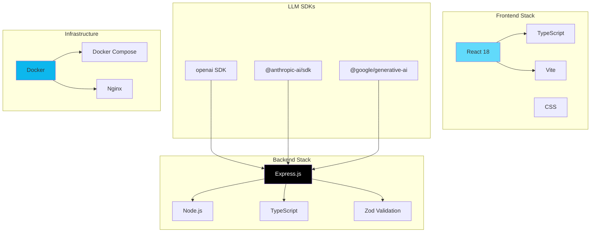

# LLM Chat App - Architecture & Dependencies

## System Architecture Diagram

## Module Dependency Graph

## Data Flow Diagram

## LLM Provider Abstraction Pattern

## Docker Architecture

## Technology Stack

