# Chunking Parameter Selection Logic

## Overview
This document describes the current logic for selecting and applying chunking parameters (chunkSize, overlap, strategy) when processing documents.

## Mermaid Diagram

```mermaid
flowchart TD
    Start([Document Upload Request]) --> ReceiveFile[Receive file via POST /api/documents/upload]
    ReceiveFile --> ExtractFormFields[Extract form fields from req.body]
    
    ExtractFormFields --> CheckChunkSize{chunkSize<br/>provided?}
    CheckChunkSize -->|Yes| ParseChunkSize[Parse chunkSize as integer]
    CheckChunkSize -->|No| DefaultChunkSize[Use default: 1000]
    
    ParseChunkSize --> ValidateChunkSize{"chunkSize in range?<br/>(100 to 10000)"}
    ValidateChunkSize -->|No| ClampChunkSize[Clamp to range:<br/>min: 100, max: 10000]
    ValidateChunkSize -->|Yes| UseChunkSize[Use parsed chunkSize]
    ClampChunkSize --> UseChunkSize
    DefaultChunkSize --> UseChunkSize
    
    ExtractFormFields --> CheckOverlap{overlap<br/>provided?}
    CheckOverlap -->|Yes| ParseOverlap[Parse overlap as integer]
    CheckOverlap -->|No| DefaultOverlap[Use default: 200]
    
    ParseOverlap --> ValidateOverlap{"overlap in range?<br/>(0 to 1000)"}
    ValidateOverlap -->|No| ClampOverlap[Clamp to range:<br/>min: 0, max: 1000]
    ValidateOverlap -->|Yes| UseOverlap[Use parsed overlap]
    ClampOverlap --> UseOverlap
    DefaultOverlap --> UseOverlap
    
    ExtractFormFields --> CheckStrategy{chunkingStrategy<br/>provided?}
    CheckStrategy -->|Yes| UseStrategy[Use provided strategy]
    CheckStrategy -->|No| DefaultStrategy[Use default: 'fixed']
    
    UseStrategy --> ValidateStrategy{"Strategy valid?<br/>(fixed, sentence,<br/>paragraph, semantic)"}
    ValidateStrategy -->|No| DefaultStrategy
    ValidateStrategy -->|Yes| UseValidStrategy[Use validated strategy]
    DefaultStrategy --> UseValidStrategy
    
    UseChunkSize --> CreateSchema
    UseOverlap --> CreateSchema
    UseValidStrategy --> CreateSchema
    
    CreateSchema[Create ChunkingSchema object:<br/>chunkSize, overlap, strategy]
    
    CreateSchema --> ExtractText[Extract text from document]
    ExtractText --> CallChunkText[Call DocumentService.chunkText<br/>text, chunkSize, overlap]
    
    CallChunkText --> ChunkingLoop[Chunking Algorithm]
    
    ChunkingLoop --> InitVars[Initialize:<br/>startIndex = 0<br/>chunkIndex = 0<br/>iterations = 0]
    
    InitVars --> CheckBounds{"startIndex<br/>&lt; text.length?"}
    CheckBounds -->|No| ReturnChunks[Return chunks array]
    CheckBounds -->|Yes| CheckMaxIter{"iterations<br/>&lt; 100000?"}
    
    CheckMaxIter -->|No| LogError[Log error:<br/>Max iterations exceeded]
    LogError --> ReturnChunks
    CheckMaxIter -->|Yes| CalculateEnd[endIndex = min<br/>startIndex + chunkSize,<br/>text.length]
    
    CalculateEnd --> SliceText[Slice text:<br/>text.slice startIndex, endIndex]
    SliceText --> CreateChunk[Create DocumentChunk:<br/>id, documentId, content,<br/>chunkIndex, startChar, endChar]
    
    CreateChunk --> AddChunk[Add chunk to chunks array]
    AddChunk --> CalculateNewStart[Calculate newStartIndex:<br/>endIndex - overlap]
    
    CalculateNewStart --> CheckLoopCondition{"newStartIndex >= endIndex<br/>OR<br/>newStartIndex &lt;= startIndex?"}
    CheckLoopCondition -->|Yes| BreakLoop[Break loop:<br/>Prevent infinite loop]
    CheckLoopCondition -->|No| UpdateStart[startIndex = newStartIndex]
    
    BreakLoop --> ReturnChunks
    UpdateStart --> IncrementIter[iterations++]
    IncrementIter --> CheckBounds
    
    ReturnChunks --> StoreChunks[Store chunks in<br/>documentId.chunks.json]
    StoreChunks --> StoreMetadata[Store ChunkingSchema<br/>in document metadata]
    
    StoreMetadata --> End([Chunking Complete])
    
    style Start fill:#e1f5ff
    style End fill:#d4edda
    style CreateSchema fill:#fff3cd
    style ChunkingLoop fill:#fff3cd
    style ReturnChunks fill:#d4edda
    style LogError fill:#f8d7da
    style BreakLoop fill:#f8d7da
```

## Current Implementation Details

### Parameter Sources
1. **Form Fields** (multipart/form-data):
   - `chunkSize` (optional, integer)
   - `overlap` (optional, integer)
   - `chunkingStrategy` (optional, string)

### Default Values
- `chunkSize`: 1000 characters
- `overlap`: 200 characters
- `chunkingStrategy`: 'fixed'

### Validation Rules
- **chunkSize**: Must be between 100 and 10,000 characters (clamped if outside range)
- **overlap**: Must be between 0 and 1,000 characters (clamped if outside range)
- **chunkingStrategy**: Must be one of: 'fixed', 'sentence', 'paragraph', 'semantic' (defaults to 'fixed' if invalid)

### Chunking Algorithm
1. Start at beginning of text (startIndex = 0)
2. Calculate end index: `min(startIndex + chunkSize, text.length)`
3. Extract chunk: `text.slice(startIndex, endIndex)`
4. Create chunk object with metadata
5. Calculate next start: `endIndex - overlap`
6. Check loop conditions to prevent infinite loops
7. Repeat until entire text is processed

### Safety Features
- Maximum iteration limit: 100,000 (prevents infinite loops)
- Loop condition checks: Prevents getting stuck when overlap >= chunkSize
- Parameter clamping: Ensures values stay within safe ranges

### Storage
- Chunking schema stored in `DocumentMetadata.chunkingSchema`
- Chunks stored in `{documentId}.chunks.json`
- Metadata persisted in `{documentId}.metadata.json`

## Future Enhancements
- Add UI controls for chunking parameters in frontend
- Implement different chunking strategies (sentence, paragraph, semantic)
- Add validation feedback for invalid parameters
- Allow re-chunking existing documents with new parameters

