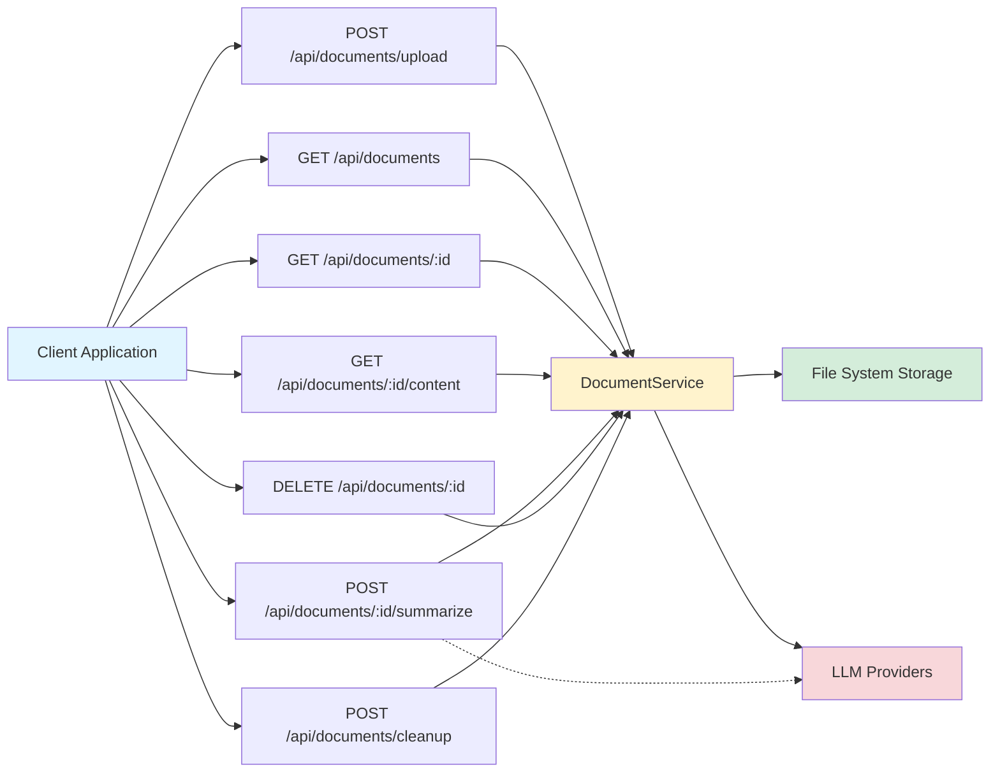
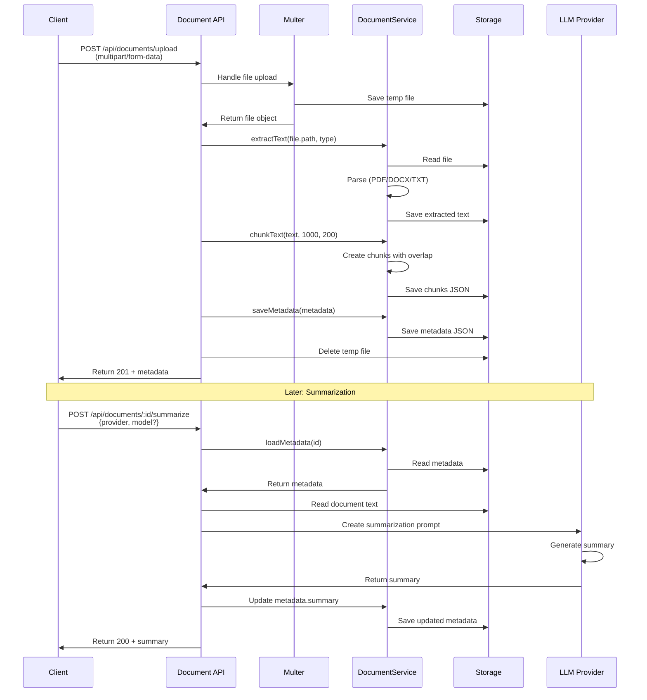
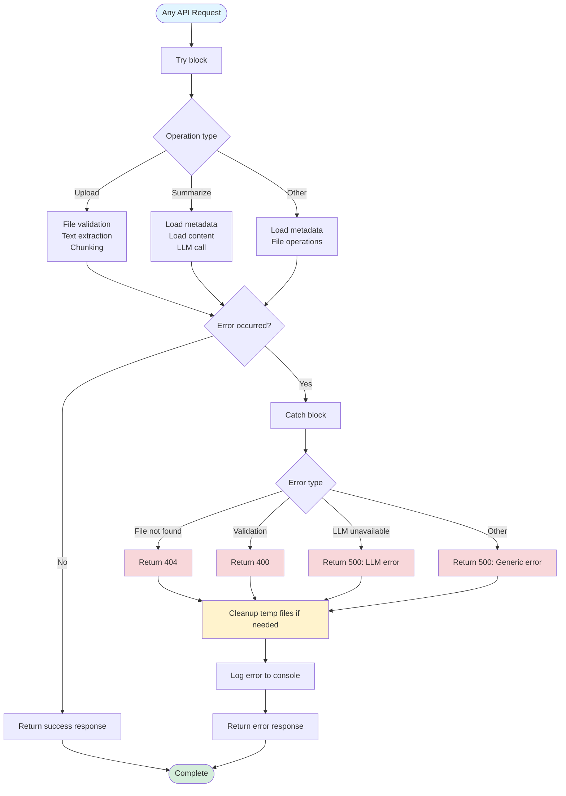

# Document Upload Flow Diagram

## Complete Flow

```mermaid
flowchart TD
    Start([User uploads document]) --> Upload[POST /api/documents/upload]
    Upload --> Multer[Multer middleware]
    Multer --> ValidateFile{File type valid?}
    
    ValidateFile -->|No| Error1[Return 400: Invalid file type]
    ValidateFile -->|Yes| SaveTemp[Save to temp upload directory]
    
    SaveTemp --> GenerateID[Generate UUID document ID]
    GenerateID --> DetectType[Detect document type<br/>PDF/DOCX/TXT]
    
    DetectType --> ExtractText[DocumentService.extractText]
    
    ExtractText --> PDFParse{Type?}
    PDFParse -->|PDF| PDFExtract[pdf-parse: Extract text]
    PDFParse -->|DOCX| DOCXExtract[mammoth: Extract text]
    PDFParse -->|TXT| TXTExtract[fs.readFile: Read text]
    
    PDFExtract --> SaveContent
    DOCXExtract --> SaveContent
    TXTExtract --> SaveContent
    
    SaveContent[Save extracted text to<br/>storage/documents/{id}.txt]
    
    SaveContent --> ChunkText[DocumentService.chunkText]
    ChunkText --> ChunkConfig[Chunk size: 1000 chars<br/>Overlap: 200 chars]
    ChunkConfig --> CreateChunks[Create DocumentChunk[]<br/>with metadata]
    CreateChunks --> SaveChunks[Save chunks to<br/>storage/documents/{id}.chunks.json]
    
    SaveChunks --> CreateMetadata[Create DocumentMetadata]
    CreateMetadata --> MetadataFields[ID, filename, type, size<br/>uploadedAt, processedAt<br/>chunkCount, indexed=false]
    MetadataFields --> SaveMetadata[Save to<br/>storage/documents/{id}.metadata.json]
    
    SaveMetadata --> CleanupTemp[Delete temp uploaded file]
    CleanupTemp --> ReturnSuccess[Return 201: Document metadata]
    
    ReturnSuccess --> End([Upload complete])
    
    style Start fill:#e1f5ff
    style End fill:#d4edda
    style Error1 fill:#f8d7da
    style SaveContent fill:#fff3cd
    style ChunkText fill:#fff3cd
    style SaveMetadata fill:#fff3cd
```

## Document Summarization Flow

```mermaid
flowchart TD
    Start([User requests summary]) --> Summarize[POST /api/documents/:id/summarize]
    Summarize --> ValidateReq{Validate request<br/>provider, model?}
    
    ValidateReq -->|Invalid| Error1[Return 400: Invalid request]
    ValidateReq -->|Valid| LoadMetadata[DocumentService.loadMetadata]
    
    LoadMetadata --> DocExists{Document exists?}
    DocExists -->|No| Error2[Return 404: Document not found]
    DocExists -->|Yes| LoadContent[Load text from<br/>storage/documents/{id}.txt]
    
    LoadContent --> ContentExists{Content exists?}
    ContentExists -->|No| Error3[Return 404: Content not found]
    ContentExists -->|Yes| GetLLMProvider[LLMFactory.getProvider]
    
    GetLLMProvider --> ProviderAvailable{Provider available?}
    ProviderAvailable -->|No| Error4[Return 500: Provider unavailable]
    ProviderAvailable -->|Yes| CreatePrompt[Create summarization prompt]
    
    CreatePrompt --> PromptContent[System: Summarization instructions<br/>User: Document text<br/>Limit: 8000 chars]
    PromptContent --> CallLLM[LLM Provider.chat]
    
    CallLLM --> LLMResponse{LLM response?}
    LLMResponse -->|Error| Error5[Return 500: Summarization failed]
    LLMResponse -->|Success| UpdateMetadata[Update metadata.summary]
    
    UpdateMetadata --> SaveUpdatedMeta[Save updated metadata]
    SaveUpdatedMeta --> ReturnSummary[Return 200: Summary + metadata]
    
    ReturnSummary --> End([Summary complete])
    
    style Start fill:#e1f5ff
    style End fill:#d4edda
    style Error1 fill:#f8d7da
    style Error2 fill:#f8d7da
    style Error3 fill:#f8d7da
    style Error4 fill:#f8d7da
    style Error5 fill:#f8d7da
    style CallLLM fill:#fff3cd
    style UpdateMetadata fill:#fff3cd
```

## Document Storage Structure

```mermaid
graph TD
    Storage[storage/] --> Documents[documents/]
    Storage --> Uploads[uploads/]
    
    Documents --> MetaFile[{id}.metadata.json]
    Documents --> ContentFile[{id}.txt]
    Documents --> ChunksFile[{id}.chunks.json]
    
    MetaFile --> MetaContent[DocumentMetadata:<br/>- id, filename, type<br/>- size, uploadedAt<br/>- processedAt, summary<br/>- chunkCount, indexed]
    
    ContentFile --> TextContent[Extracted text content<br/>plain text format]
    
    ChunksFile --> ChunksContent[DocumentChunk[]:<br/>- id, documentId<br/>- content, chunkIndex<br/>- startChar, endChar<br/>- metadata]
    
    Uploads --> TempFiles[Temporary uploaded files<br/>Deleted after processing]
    
    style Storage fill:#e1f5ff
    style Documents fill:#d4edda
    style Uploads fill:#fff3cd
```

## API Endpoints Overview



## Document Processing Pipeline



## Data Flow: Upload to RAG (Future)

```mermaid
flowchart LR
    Upload[Document Upload] --> Extract[Text Extraction]
    Extract --> Chunk[Chunking]
    Chunk --> Store[File Storage]
    
    Store --> Embed[Embeddings<br/>Future: Phase 10]
    Embed --> VectorDB[Vector DB<br/>Chroma - Future]
    
    VectorDB --> RAG[RAG Pipeline<br/>Future: Phase 11]
    RAG --> Query[Query Interface<br/>Future: Phase 13]
    
    style Upload fill:#e1f5ff
    style Extract fill:#fff3cd
    style Chunk fill:#fff3cd
    style Store fill:#d4edda
    style Embed fill:#f0f0f0
    style VectorDB fill:#f0f0f0
    style RAG fill:#f0f0f0
    style Query fill:#f0f0f0
```



## Error Handling Flow



